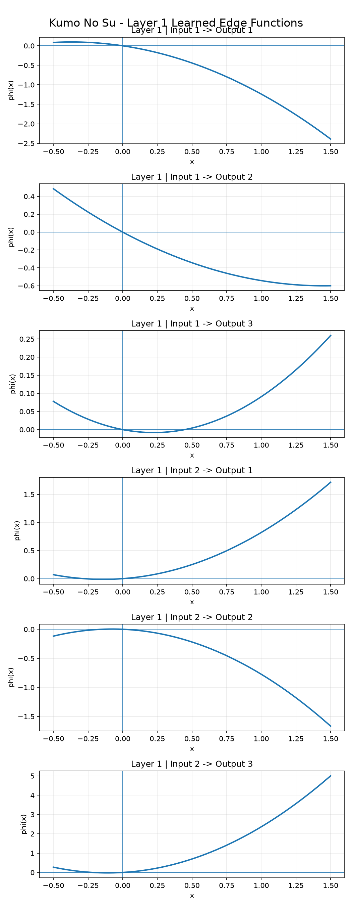
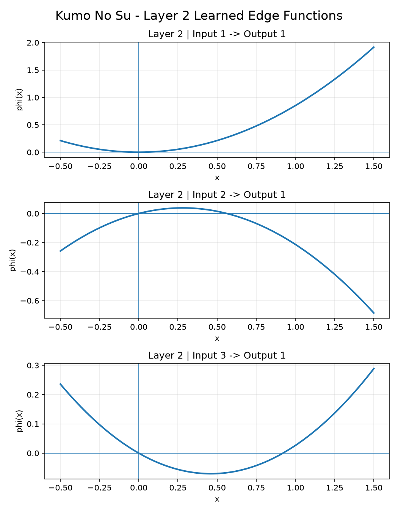
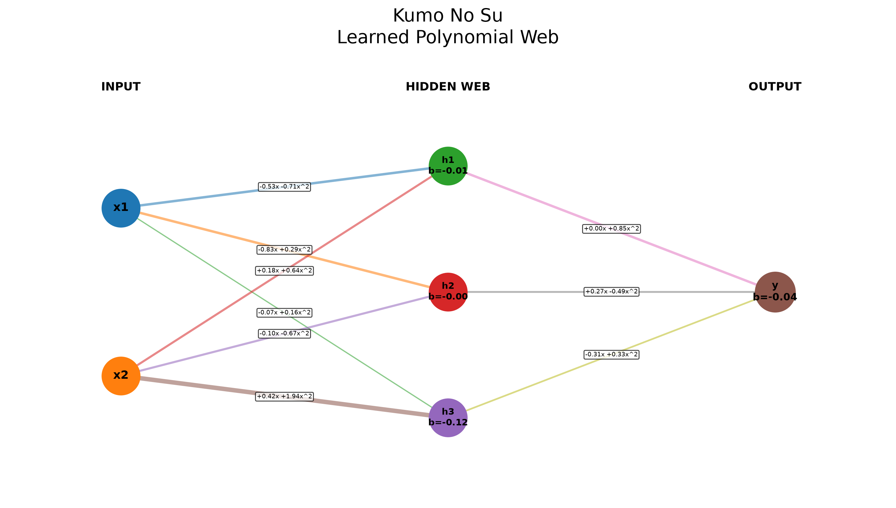
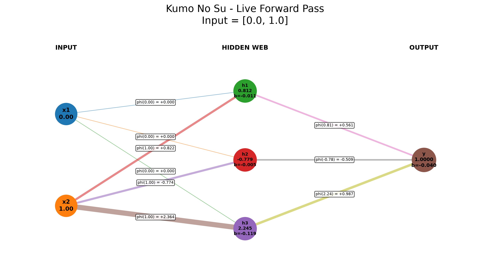
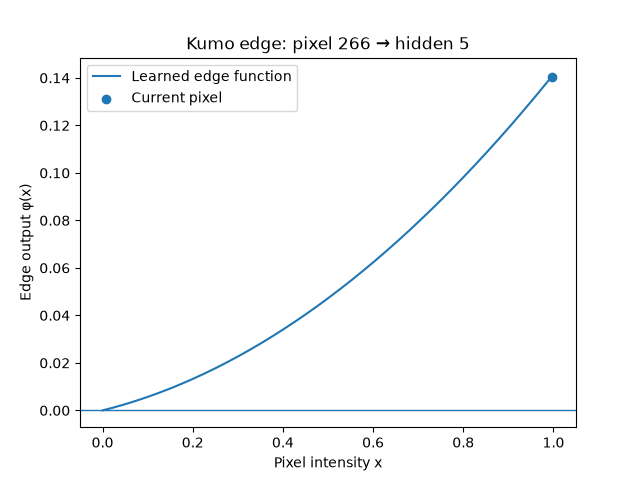
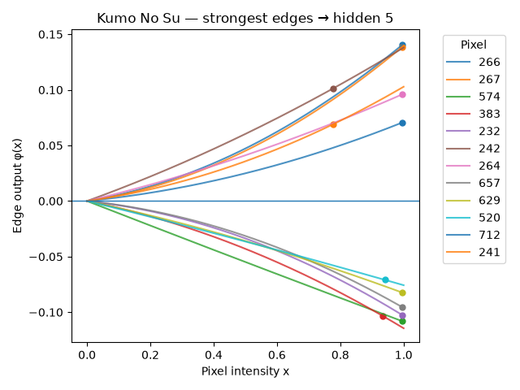
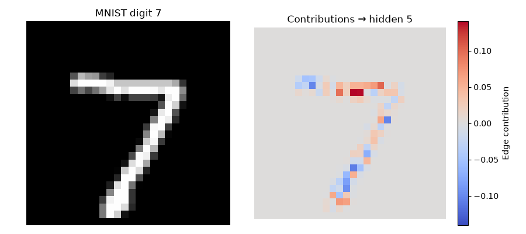
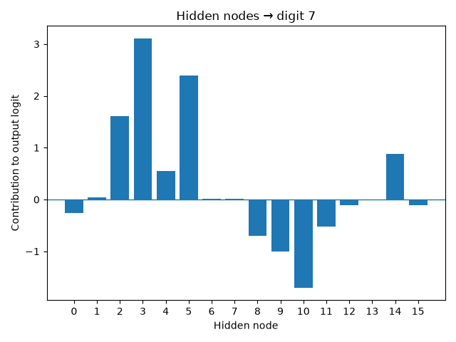
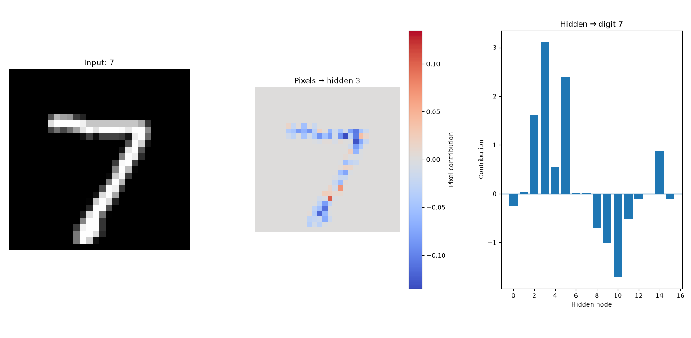

<div align="center">


# Kumo No Su

### 蜘蛛の巣

**A neural network built from scratch where the edges learn functions.**


**Dibyanshu Kumar | Indian Institute of Technology Madras | September - October 2026**

</div>

------------------------------------------------------------------------

## What is Kumo No Su?

Kumo No Su is my from-scratch neural-network project.

I started it to understand neural networks by actually implementing the
mathematics myself instead of hiding the important parts behind PyTorch,
TensorFlow, autograd, or another machine-learning framework.

The central idea became:

> **Kumo learns by reshaping functions on edges.**

A conventional dense neural network normally gives each connection a
scalar weight. Kumo gives each connection a learnable polynomial
function.

The current Kumo v2 edge is

```math
\phi_{ij}(x_i)=\sum_{d=1}^{D} c_{ijd}x_i^d
```

and a node computes

```math
\boxed{
y_j=b_j+\sum_i\phi_{ij}(x_i)
}
```

So the edge owns the input-dependent function and the node owns the
baseline bias.

The project grew from a single polynomial edge into a complete system
with:

-   forward propagation
-   analytical backpropagation
-   batch training
-   gradient descent
-   numerical gradient checking
-   multi-layer networks
-   model persistence
-   legacy-model conversion
-   softmax and cross-entropy
-   XOR learning
-   MNIST classification
-   network and edge visualization
-   contribution tracing
-   a handwritten-digit drawing application

The current full MNIST model reaches:

> **91.50% accuracy on the untouched 10,000-image MNIST test set.**

The test set was not used for training or checkpoint selection.

------------------------------------------------------------------------

# The idea

In a standard neural network, a connection typically contributes
something like

```math
wx
```

and nonlinearity is usually introduced by a fixed activation function at
the node.

My original Kumo idea moved more of the learnable behavior onto the
connections themselves:

```math
\phi(x)=c_0+c_1x+c_2x^2+\dots+c_kx^k
```

Each connection can therefore learn its own curve instead of only
learning one scalar multiplier.

The node then combines the outputs of all incoming edge functions.

This produced the "spider web" idea behind the name **Kumo No Su**.

------------------------------------------------------------------------

# The learning journey

This repository intentionally contains the path I took while learning,
not only the final cleaned implementation.

Two directories are especially important:

``` text
Kumo Learning/
learning-2/
```

They are not dead code that I forgot to delete. They are the development
history of the project.

`Kumo Learning/` contains the early progression through individual
concepts such as:

``` text
single_neuron.py
vector_feature.py
learnable_coefficients.py
forward_pass.py
error.py
gradient.py
parameter_update.py
activation_fn.py
2layer.py
vectorized_bp.py
modular.py
```

`learning-2/` records the next stage, when those pieces started turning
into the Kumo architecture:

``` text
kumo_array.py
kumo_forward.py
kumo_layer.py
kumo_network.py
dataset_loader.py
mnist_main.py
symbolic_exporter.py
visualize_edges.py
visualize_mnist.py
```

The current implementation lives in:

``` text
kumo/
```

Keeping the earlier directories makes it possible to see how the
implementation and my understanding changed instead of presenting the
final code as if it appeared fully formed.

------------------------------------------------------------------------

# From one polynomial edge to a network

The first useful mathematical object was one learnable polynomial:

```math
\phi(x)=c_0+c_1x+c_2x^2
```

For each coefficient,

```math
\frac{\partial\phi}{\partial c_d}=x^d
```

Using squared error,

```math
L=\frac12(\hat y-y)^2
```

gives

```math
\frac{\partial L}{\partial \hat y}=\hat y-y
```

and therefore

```math
\frac{\partial L}{\partial c_d}
=
(\hat y-y)x^d
```

A gradient-descent update is

```math
c_d^{new}
=
c_d^{old}
-
\eta
\frac{\partial L}{\partial c_d}
```

That was the first complete learning loop:

``` text
input
  ↓
polynomial edge
  ↓
prediction
  ↓
loss
  ↓
gradient
  ↓
coefficient update
```

From there I extended the same idea to multiple inputs, multiple
outputs, batches, and multiple layers.

------------------------------------------------------------------------

# Multiple inputs

For a node receiving several inputs,

```math
y_j=\sum_i\phi_{ij}(x_i)
```

in the original formulation.

For polynomial degree 2:

```math
\phi_{ij}(x_i)
=
c_{ij0}
+
c_{ij1}x_i
+
c_{ij2}x_i^2
```

This meant every input/output pair had its own set of polynomial
coefficients.

The original coefficient tensor was conceptually:

``` text
C[input][output][coefficient]
```

or, in NumPy:

``` text
(n_inputs, n_outputs, degree + 1)
```

That representation became Kumo v1.

------------------------------------------------------------------------

# Backpropagation through a Kumo edge

The derivative of a polynomial edge with respect to its input is

```math
\frac{d\phi}{dx}
=
c_1+2c_2x+3c_3x^2+\dots
```

For an upstream gradient

```math
g_j=\frac{\partial L}{\partial y_j}
```

the gradient passed to input `x_i` is

```math
\frac{\partial L}{\partial x_i}
=
\sum_j
g_j
\frac{\partial \phi_{ij}(x_i)}{\partial x_i}
```

This is the chain rule that allows Kumo layers to be stacked.

For batches, Kumo computes sample gradients and averages parameter
gradients across the batch.

That detail later became important when softmax + cross-entropy was
added: the output gradient should not be divided by the batch size a
second time because `KumoLayer.backward()` already performs the
averaging for its parameters.

------------------------------------------------------------------------

# XOR: proving the network could learn nonlinear structure

Before MNIST, XOR was the main proving ground.

A small network with polynomial edges successfully learned XOR:

``` text
2 inputs
   ↓
3 hidden Kumo nodes
   ↓
1 output
```

with degree-2 edge functions.

This stage was also where the visualization system began. Instead of
treating the network as an opaque collection of numbers, I started
plotting the actual functions learned by individual edges.

## Learned edge functions

<p align="center">
  
</p>
<p align="center">
  
</p>
## Learned polynomial web

<p align="center">
  
</p>
The graph is a useful representation of the architecture: nodes
aggregate information, while the edges contain learned mathematical
behavior.

------------------------------------------------------------------------

# Why degree 2 matters

A degree-1 Kumo edge is

```math
\phi_{ij}(x_i)=c_{ij1}x_i
```

so a layer is

```math
y_j=b_j+\sum_i c_{ij1}x_i
```

which is simply an affine transformation.

Stacking affine layers without a nonlinear activation still collapses to
another affine transformation.

Degree 2 changes that:

```math
\phi_{ij}(x_i)
=
c_{ij1}x_i+c_{ij2}x_i^2
```

Now the network contains genuine nonlinear terms.

This showed up in the MNIST experiments as well.

Under the same general protocol:

<div align="center">
<table>
  <thead><tr><th align="center">Model</th><th align="center">Test accuracy</th></tr></thead>
  <tbody>
    <tr><td align="center">Degree 1</td><td align="center">88.89%</td></tr>
    <tr><td align="center">Degree 2</td><td align="center"><strong>91.50%</strong></td></tr>
  </tbody>
</table>
</div>

This is useful experimental evidence for the value of the quadratic
terms in this implementation, but it is **not a capacity-matched
scientific proof** that degree 2 is universally superior. The models do
not have exactly the same effective parameterization/capacity.

------------------------------------------------------------------------

# Moving to MNIST

XOR eventually stopped being the interesting problem. The goal was
always to make Kumo recognize real handwritten digits.

That introduced an immediate scaling problem.

For MNIST there are 784 input pixels, so even a small hidden layer
creates many polynomial edges:

``` text
784 × hidden_nodes × polynomial_coefficients
```

The final architecture used for the main experiment was:

``` text
784 pixels
    ↓
16 hidden Kumo nodes
    ↓
10 digit outputs
```

with degree-2 functions on both layers.

------------------------------------------------------------------------

# MNIST data pipeline

MNIST is loaded using `fetch_openml`, converted to `float64`, and
normalized to the range `[0, 1]`.

The official split is preserved:

``` text
60,000 training images
10,000 test images
```

For the final experiment, the 60,000-image training portion was further
divided into:

``` text
50,000 training
10,000 validation
```

The official 10,000-image test set remained untouched until final
evaluation.

The data pipeline was explicitly checked:

``` text
official train: (60000, 784)
official test:  (10000, 784)
pixel minimum:  0
pixel maximum:  1
```

------------------------------------------------------------------------

# First MNIST experiment: mean squared error

The early classifier still used mean squared error.

With 2,000 training examples, accuracy progressed from 8.20% to 57.20%:

``` text
Initial test accuracy: 8.20%

Epoch  1 | Loss: 1.109028 | Test accuracy: 15.40%
Epoch  2 | Loss: 0.726930 | Test accuracy: 24.60%
Epoch  3 | Loss: 0.623147 | Test accuracy: 25.60%
Epoch  4 | Loss: 0.568476 | Test accuracy: 35.00%
Epoch  5 | Loss: 0.522545 | Test accuracy: 38.40%
Epoch  6 | Loss: 0.491264 | Test accuracy: 42.80%
Epoch  7 | Loss: 0.469753 | Test accuracy: 50.20%
Epoch  8 | Loss: 0.445547 | Test accuracy: 52.80%
Epoch  9 | Loss: 0.432766 | Test accuracy: 54.00%
Epoch 10 | Loss: 0.416534 | Test accuracy: 57.20%
```

Sample predictions included:

``` text
True: 5 | Predicted: 8
True: 8 | Predicted: 8
True: 8 | Predicted: 3
True: 4 | Predicted: 9
True: 2 | Predicted: 2
True: 6 | Predicted: 6
True: 9 | Predicted: 7
True: 7 | Predicted: 7
True: 1 | Predicted: 1
True: 0 | Predicted: 0
```

The network was learning, but MSE was not a good classification
objective.

------------------------------------------------------------------------

# Softmax + cross-entropy

Rather than immediately modifying the core layer/network code, I
implemented and verified the classification mathematics separately.

Kumo's raw output is a vector of logits:

``` text
[-0.3, 0.8, 1.4, -0.1, ...]
```

Softmax converts these into probabilities:

```math
p_i
=
\frac{e^{z_i-\max(z)}}{
\sum_j e^{z_j-\max(z)}
}
```

Subtracting the maximum logit improves numerical stability.

Cross-entropy for a one-hot target is

```math
L=-\sum_i y_i\log p_i
```

which reduces to

```math
L=-\log p_y
```

for the correct class.

The especially useful result is the combined softmax + cross-entropy
gradient:

```math
\boxed{
\frac{\partial L}{\partial z_i}
=
p_i-y_i
}
```

------------------------------------------------------------------------

# MSE vs softmax + cross-entropy

The difference was immediate.

<div align="center">
<table>
  <thead><tr><th align="center">Epoch</th><th align="center">MSE run</th><th align="center">Softmax + CE</th></tr></thead>
  <tbody>
    <tr><td align="center">Initial</td><td align="center">8.2%</td><td align="center">8.2%</td></tr>
    <tr><td align="center">1</td><td align="center">15.4%</td><td align="center"><strong>19.2%</strong></td></tr>
    <tr><td align="center">4</td><td align="center">35.0%</td><td align="center"><strong>59.8%</strong></td></tr>
    <tr><td align="center">5</td><td align="center">38.4%</td><td align="center"><strong>66.2%</strong></td></tr>
    <tr><td align="center">7</td><td align="center">50.2%</td><td align="center"><strong>74.0%</strong></td></tr>
    <tr><td align="center">10</td><td align="center">57.2%</td><td align="center"><strong>70.0%</strong></td></tr>
  </tbody>
</table>
</div>

The 2,000-image softmax experiment produced:

``` text
Initial test accuracy: 8.20%

Epoch  1 | Loss: 2.245858 | Test accuracy: 19.20%
Epoch  2 | Loss: 1.994225 | Test accuracy: 36.20%
Epoch  3 | Loss: 1.719079 | Test accuracy: 46.00%
Epoch  4 | Loss: 1.453370 | Test accuracy: 59.80%
Epoch  5 | Loss: 1.228908 | Test accuracy: 66.20%
Epoch  6 | Loss: 1.078881 | Test accuracy: 70.00%
Epoch  7 | Loss: 0.954219 | Test accuracy: 74.00%
Epoch  8 | Loss: 0.855795 | Test accuracy: 71.60%
Epoch  9 | Loss: 0.797729 | Test accuracy: 63.20%
Epoch 10 | Loss: 0.739852 | Test accuracy: 70.00%
```

Some sample predictions:

``` text
True: 5 | Predicted: 4 | Confidence: 95.90%
True: 8 | Predicted: 8 | Confidence: 85.91%
True: 8 | Predicted: 4 | Confidence: 82.09%
True: 4 | Predicted: 4 | Confidence: 99.26%
True: 2 | Predicted: 2 | Confidence: 88.12%
True: 6 | Predicted: 6 | Confidence: 98.95%
True: 9 | Predicted: 4 | Confidence: 69.56%
True: 7 | Predicted: 7 | Confidence: 99.13%
True: 1 | Predicted: 1 | Confidence: 71.56%
True: 0 | Predicted: 0 | Confidence: 99.96%
```

An important lesson from these examples is that a high softmax
probability is **not automatically a calibrated confidence estimate**.
The network can be confidently wrong.

------------------------------------------------------------------------

# MNIST progression

The training progression was:

<div align="center">
<table>
  <thead><tr><th align="center">Experiment</th><th align="center">Training data</th><th align="center">Best accuracy</th></tr></thead>
  <tbody>
    <tr><td align="center">MSE prototype</td><td align="center">2,000</td><td align="center">57.2%</td></tr>
    <tr><td align="center">Softmax + CE</td><td align="center">2,000</td><td align="center">74.0% validation</td></tr>
    <tr><td align="center">Softmax + CE</td><td align="center">10,000</td><td align="center">89.4% validation</td></tr>
    <tr><td align="center">Full experiment</td><td align="center">50,000</td><td align="center"><strong>91.84% validation</strong></td></tr>
    <tr><td align="center">Untouched test set</td><td align="center">10,000</td><td align="center"><strong>91.50% test</strong></td></tr>
  </tbody>
</table>
</div>

The final validation/test gap was:

```math
91.84-91.50=0.34
```

percentage points.

------------------------------------------------------------------------

# Final MNIST experiment

The final training setup was approximately:

``` text
Architecture:   784 → 16 → 10
Edge degree:    2
Batch size:     32
Epochs:         10
Learning rate:  0.001
Loss:           softmax + cross-entropy
Training:       50,000 images
Validation:     10,000 images
Final test:     official untouched 10,000 images
```

Training result:

``` text
Initial validation accuracy: 8.70%

Epoch  1 | Loss: 0.922758 | Validation accuracy: 81.30% SAVED
Epoch  2 | Loss: 0.456025 | Validation accuracy: 87.99% SAVED
Epoch  3 | Loss: 0.390213 | Validation accuracy: 87.49%
Epoch  4 | Loss: 0.356240 | Validation accuracy: 90.86% SAVED
Epoch  5 | Loss: 0.334326 | Validation accuracy: 89.45%
Epoch  6 | Loss: 0.316056 | Validation accuracy: 89.50%
Epoch  7 | Loss: 0.303084 | Validation accuracy: 91.53% SAVED
Epoch  8 | Loss: 0.291183 | Validation accuracy: 90.41%
Epoch  9 | Loss: 0.284314 | Validation accuracy: 91.64% SAVED
Epoch 10 | Loss: 0.275793 | Validation accuracy: 91.84% SAVED

Best epoch: 10
Best validation accuracy: 91.84%
Final test accuracy: 91.50%
```

Two things stood out.

First, the loss was still decreasing at epoch 10:

``` text
Epoch 9  | Loss 0.284314 | Validation 91.64%
Epoch 10 | Loss 0.275793 | Validation 91.84%
```

Second, epoch 10 was also the best validation checkpoint.

The final 10,000-image test set was not used to train Kumo or select the
checkpoint.

------------------------------------------------------------------------

# Kumo v1 parameter count

The original v1 architecture stored a constant coefficient on every
edge.

For degree 2, every edge stored:

``` text
c0, c1, c2
```

For the MNIST architecture:

```math
784(16)(3)+16(10)(3)
```

```math
=37,632+480
```

```math
=\boxed{38,112}
```

learned coefficients.

That was the parameter count recorded for the original 91.50% MNIST
model.

Then an architectural redundancy became obvious.

------------------------------------------------------------------------

# The c0 problem

In Kumo v1, a node received:

```math
y_j
=
\sum_i
\left(
c_{ij0}
+
c_{ij1}x_i
+
c_{ij2}x_i^2
\right)
```

Rearranging gives:

```math
y_j
=
\underbrace{
\sum_i c_{ij0}
}_{\text{one constant}}
+
\sum_i
\left(
c_{ij1}x_i
+
c_{ij2}x_i^2
\right)
```

All of the constant edge terms feeding the same node collapse into one
number.

Define

```math
b_j=\sum_i c_{ij0}
```

and the layer becomes

```math
\boxed{
y_j
=
b_j
+
\sum_i
\left(
c_{ij1}x_i
+
c_{ij2}x_i^2
\right)
}
```

This means separate `c0` values on every incoming edge are
representationally redundant.

There was also a training-level clue.

For every incoming edge constant:

```math
\frac{\partial L}{\partial c_{ij0}}
=
\frac{\partial L}{\partial y_j}
```

Every `c0` feeding the same node receives the same gradient.

When they are initialized identically, they therefore evolve identically
apart from floating-point effects.

That observation led directly to Kumo v2.

------------------------------------------------------------------------

# Testing c0 compression before changing the architecture

I did not want to refactor the core architecture based only on
intuition.

The existing v1 MNIST model was compressed mathematically:

```math
b_j=\sum_i c_{ij0}
```

while the remaining coefficients became:

```math
C_{ij}=[c_{ij1},c_{ij2},\dots]
```

The original and compressed networks were compared across 10,000 MNIST
test images.

Results:

``` text
maximum hidden difference: 0.0
maximum output difference: 0.0
prediction mismatches:     0
original accuracy:         91.50%
compressed accuracy:       91.50%
```

The final regression test produced exact equality for both recorded maximum differences.

There was no representational loss.

That experiment justified changing the architecture.

------------------------------------------------------------------------

# Kumo v2

Kumo v2 makes the separation explicit:

```math
\boxed{
y_j=b_j+\sum_i\phi_{ij}(x_i)
}
```

with

```math
\boxed{
\phi_{ij}(x_i)
=
\sum_{d=1}^{D}
c_{ijd}x_i^d
}
```

The node owns:

``` text
b[j]
```

The edge owns:

``` text
c1, c2, ..., cD
```

There is no longer a constant term stored separately on every edge.

For degree 2:

``` text
C.shape = (n_inputs, n_outputs, 2)
```

where:

``` text
C[..., 0] = c1
C[..., 1] = c2
```

and:

``` text
b.shape = (n_outputs,)
```

This is now the canonical Kumo architecture.

------------------------------------------------------------------------

# Parameter reduction in v2

The v1 MNIST model contained:

``` text
38,112 parameters
```

The equivalent v2 representation contains:

``` text
25,434 parameters
```

So v2 removes:

``` text
12,678 parameters
```

or about:

``` text
33.3%
```

of the original stored parameters.

This reduction did **not** remove the learned function represented by
the old network. It removed redundant ways of representing the same
node-level constant.

The legacy model still produces **91.50% test accuracy after
conversion**.

------------------------------------------------------------------------

# v1 → v2 model compatibility

I did not want the v2 refactor to invalidate the trained v1 models.

Kumo model files therefore have a format version.

v2 saves:

``` text
format_version
n_layers
layer configuration
C
b
```

When a model without a format version is loaded, it is treated as a v1
model.

For every old layer:

``` python
b = np.sum(old_C[:, :, 0], axis=0)
C = old_C[:, :, 1:].copy()
```

This converts the old per-edge constants into one bias per destination
node.

A conversion test loaded the original MNIST model and produced:

``` text
layer 1 C shape: (784, 16, 2)
layer 1 b shape: (16,)

layer 2 C shape: (16, 10, 2)
layer 2 b shape: (10,)
```

The converted network retained:

``` text
10,000-image test accuracy: 91.50%
```

So v2 could become the canonical implementation without throwing away
the v1 training result.

------------------------------------------------------------------------

# Backward API changes in v2

The layer now learns two parameter groups:

``` text
edge coefficients C
node biases b
```

`KumoLayer.backward()` therefore returns:

``` python
(
    coefficient_gradients,
    bias_gradients,
    input_gradients
)
```

At the network level, `KumoNetwork.backward()` stores parameter
gradients for each layer as:

``` python
(
    coefficient_gradients,
    bias_gradients
)
```

The propagated input gradient is used internally to continue
backpropagation through previous layers.

Several experiments had to be migrated because older code assumed that a
gradient was only one coefficient array.

That migration was part of the v2 cleanup rather than a change to the
mathematics.

------------------------------------------------------------------------

# Numerical gradient checking

A from-scratch backpropagation implementation can appear to train while
still containing subtle derivative errors, so numerical gradient
checking became one of the most important validation tools in the
project.

For a parameter `θ`, the numerical derivative is
approximated by:

```math
\frac{\partial L}{\partial\theta}
\approx
\frac{
L(\theta+\epsilon)-L(\theta-\epsilon)
}{
2\epsilon
}
```

and compared against the analytical gradient produced by Kumo's backward
pass.

## Original full-network check

For the earlier 2 → 3 → 1 degree-2 network:

``` text
coefficients checked: 27
failed:               0
largest difference:   1.6744738929e-10
PASS
```

## Kumo v2 layer check

After introducing node biases:

``` text
values checked:       17
failed:               0
largest difference:   1.0718548271171358e-10
PASS
```

## Kumo v2 full-network check

For the complete multi-layer backward path:

``` text
parameters checked:   22
failed:               0
largest difference:   2.201709925486739e-10
PASS
```

These tests are much stronger evidence for the derivative implementation
than simply observing decreasing training loss.

------------------------------------------------------------------------

# Other validation

The project accumulated several independent checks.

## Save/load

A v2 XOR model was saved and reloaded.

``` text
maximum prediction difference: 0.0
format: v2
```

## Legacy conversion

The v1 MNIST model was loaded through the v2 compatibility path.

``` text
test accuracy after conversion: 91.50%
```

## Contribution reconstruction

The v2 contribution and polynomial inspectors reconstruct layer outputs
to floating-point precision.

Typical reconstruction error:

``` text
~8.88e-16
```

## Manual forward reconstruction

The visualization code independently reconstructed a live forward pass:

``` text
Input:
[0. 1.]

Layer 1 edge contributions:
[[ 0.          0.          0.        ]
 [ 0.82229718 -0.77417039  2.36409961]]

Layer 1 bias:
[-0.01064405 -0.00477438 -0.1193216 ]

Hidden node values:
[ 0.81165313 -0.77894478  2.24477801]

Layer 2 edge contributions:
[[ 0.56136052]
 [-0.5086955 ]
 [ 0.98731319]]

Layer 2 bias:
[-0.03997821]

Visualizer output:
[1.]

Kumo forward() output:
[1.]

Difference: [0.]
```

That exact zero difference was an important sanity check: the visual
explanation and the actual network were computing the same model.

<p align="center">
  
</p>
------------------------------------------------------------------------

# A useful v2 consequence: zero input means zero edge contribution

In v2 the edge function has no constant term:

```math
\phi(0)=0
```

For the XOR forward-pass example above, the first input was zero.

Its contributions were therefore exactly:

``` text
[0. 0. 0.]
```

The baseline behavior now comes from the destination node's bias rather
than being duplicated across incoming edges.

That is exactly the separation v2 was intended to create.

------------------------------------------------------------------------

# MNIST numerical-health debugging

The MNIST path was also checked after the v2 migration.

A one-batch debugger inspected:

``` text
input
hidden activations
output logits
error
layer 1 coefficient gradients
layer 1 bias gradients
layer 2 coefficient gradients
layer 2 bias gradients
parameters before update
parameters after update
```

All checked values were finite.

This verified the complete:

``` text
MNIST batch
   ↓
forward
   ↓
softmax / loss gradient
   ↓
network backward
   ↓
C gradients + b gradients
   ↓
update
```

path after the architectural refactor.

------------------------------------------------------------------------

# Interpreting what Kumo learned

A major goal became making the network inspectable.

Because an edge is a mathematical function rather than only a scalar, it
can be plotted directly.

## One learned edge

<p align="center">
  
</p>
This graph shows the response curve learned by a specific pixel →
hidden-node connection.

The x-axis is the input pixel intensity.

The y-axis is that edge's contribution.

Instead of asking only "what is the weight?", Kumo lets me ask:

> What function did this connection learn?

## Strong edge functions

<p align="center">
  
</p>
This compares several influential learned edge curves feeding a hidden
node.

## Pixel contribution map

<p align="center">
  
</p>
This maps the signed contribution of input pixels to a hidden node back
into the original image geometry.

Positive and negative contributions can therefore be inspected
spatially.

## Input and contribution inspection

<p align="center">
  
</p>
This places an MNIST input beside its contribution map.

## Hidden activations

<p align="center">
  
</p>
The hidden layer can also be inspected as a vector of activations.

An earlier version of this visualization is preserved as part of the
project's development history:

<p align="center">
  
</p>
## Combined inspection

<p align="center">
  
</p>
This combines multiple parts of the explanation pipeline for a
prediction.

------------------------------------------------------------------------

# Polynomial decomposition

For a degree-2 v2 edge:

```math
\phi(x)=c_1x+c_2x^2
```

A hidden node can be decomposed into:

```math
h
=
b
+
\sum_i c_{i1}x_i
+
\sum_i c_{i2}x_i^2
```

One inspected hidden node produced:

``` text
Hidden node: 5
Node bias: 4.188406325638358

Digit | Bias     | c1*x     | c2*x^2   | Activation
---------------------------------------------------
    0 |   4.1884 |  -0.9447 |  -0.4027 |     2.8410
    1 |   4.1884 |  -0.4194 |  -0.1130 |     3.6560
    2 |   4.1884 |  -2.0494 |  -1.1282 |     1.0108
    3 |   4.1884 |  -1.6835 |  -0.4629 |     2.0420
    4 |   4.1884 |  -0.8796 |  -0.3197 |     2.9891
    5 |   4.1884 |  -1.6930 |  -0.7523 |     1.7431
    6 |   4.1884 |  -1.6953 |  -0.4651 |     2.0280
    7 |   4.1884 |   0.2596 |   0.1657 |     4.6137
    8 |   4.1884 |  -1.9157 |  -0.8296 |     1.4432
    9 |   4.1884 |  -0.3337 |   0.4339 |     4.2887
```

The inspector independently compared every reconstructed activation with
`KumoLayer.forward()` and found no mismatch.

This is useful because it exposes how much of a node's activation comes
from:

``` text
baseline bias
linear polynomial terms
quadratic polynomial terms
```

instead of only showing the final activation.

------------------------------------------------------------------------

# End-to-end prediction tracing

The inspection tools eventually became an end-to-end trace:

``` text
MNIST image
   ↓
pixel values
   ↓
pixel → hidden edge contributions
   ↓
hidden activations
   ↓
hidden → output edge contributions
   ↓
output logits
   ↓
softmax
   ↓
predicted digit
```

The point is not to claim that this makes every decision trivially
interpretable.

It does make the actual arithmetic of a prediction accessible and
testable.

The visualizers are not separate approximations of Kumo. They use the
same learned coefficients and biases and have been checked against
`network.forward()`.

------------------------------------------------------------------------

# Handwritten digit application

After training, saving, loading, and inspecting the network worked, I
moved to the original practical goal: drawing a digit and asking Kumo to
recognize it.

The app is:

``` text
app/draw_digit.py
```

It uses:

``` text
Tkinter
Pillow
NumPy
Matplotlib
```

The interface supports:

``` text
Draw digit
Predict
Inspect Prediction
Show Kumo Input
Clear
```

The drawing starts as a larger canvas and is converted into the 28 × 28
representation expected by the MNIST model.

------------------------------------------------------------------------

# Drawing preprocessing

A hand-drawn canvas is not automatically distributed like MNIST.

Preprocessing therefore became important.

The drawing is converted to grayscale, resized/placed into the
MNIST-like input representation, normalized, and center-aligned.

For image intensity `p_xy`, the center of mass is:

```math
c_x
=
\frac{
\sum_{x,y}x\,p_{xy}
}{
\sum_{x,y}p_{xy}
}
```

```math
c_y
=
\frac{
\sum_{x,y}y\,p_{xy}
}{
\sum_{x,y}p_{xy}
}
```

For a 28 × 28 image, the target center is:

```math
(13.5,13.5)
```

The image is shifted toward that center before being flattened into 784
normalized pixels.

This substantially improved recognition of drawings compared with
sending raw canvas pixels directly into a model trained on MNIST.

A drawing-event issue that could create disconnected strokes/circles was
also fixed by handling continuous brush movement more carefully.

The application became much more usable after those changes.

------------------------------------------------------------------------

# Why the drawing app still makes mistakes

The trained model gets 91.50% on MNIST, not 100%.

A user's mouse-drawn or trackpad-drawn digit is also not necessarily
distributed like MNIST.

That creates two different sources of errors:

1.  normal model error
2.  distribution shift between MNIST and live drawings

Digits such as 1, 9, and 5 were among the cases that could still be
troublesome in live testing.

That is not evidence that the forward pass is broken. The same model
passes the untouched MNIST evaluation and the drawing path uses the same
`KumoNetwork.forward()` implementation.

Improving the live app further would require better preprocessing,
augmentation/retraining, a stronger model, or some combination of
those---not arbitrary changes until every hand drawing happens to work.

------------------------------------------------------------------------

# Visualization migration during v2

The v2 change exposed an important class of bugs in the visualization
code.

In v1, coefficient index 0 meant:

``` text
c0
```

In v2, coefficient index 0 means:

``` text
c1
```

because the constant is now stored separately as `b`.

Some older visualization loops still did:

``` python
for degree, coefficient in enumerate(coefficients):
```

which incorrectly interpreted the first v2 coefficient as degree 0.

They were migrated to:

``` python
for degree, coefficient in enumerate(coefficients, start=1):
```

The affected visualization code included edge plotting, network
plotting, forward visualization, edge inspection, and polynomial-term
comparison.

The old polynomial-term inspector also assumed:

``` text
coefficients[:, 0] = c0
coefficients[:, 1] = c1
coefficients[:, 2] = c2
```

That became invalid in v2 and was rewritten around:

``` text
bias
c1
c2
```

with a reconstruction assertion against the actual layer output.

This was a useful lesson from the refactor: **model compatibility is not
enough; every diagnostic tool must share the same mathematical
semantics.**

------------------------------------------------------------------------

# Errors and fixes encountered

This project was built incrementally, and several mistakes or weak
approaches were useful parts of the process.

## MSE for classification

**Problem:** The first MNIST classifier used mean squared error.

**Result:** It learned, but reached only 57.2% in the early 2,000-image
experiment.

**Fix:** Implement and verify softmax + cross-entropy separately.

**Result:** The comparable 2,000-image run reached 74.0% validation
accuracy.

------------------------------------------------------------------------

## Redundant c0 coefficients

**Problem:** Every edge stored a constant term even though all incoming
constants to a node only matter through their sum.

**Investigation:** Algebraic derivation plus a 10,000-image equivalence
test.

**Fix:** Move the constant baseline to one node bias.

**Result:** About one third of the v1 MNIST parameter representation was
removed with no prediction changes.

------------------------------------------------------------------------

## v2 backward return structure

**Problem:** Old experiments expected a layer/network gradient to
contain only coefficient gradients.

**Fix:** Migrate callers to handle both coefficient and bias gradients.

------------------------------------------------------------------------

## Debugger tuple mistake

**Problem:** An MNIST debugger passed an entire
`(C_gradient, b_gradient)` tuple into a statistics function that
expected an array.

**Fix:** Report coefficient and bias gradients separately.

**Result:** The v2 MNIST forward/backward/update path passed the
finite-value health check.

------------------------------------------------------------------------

## Old visualizer degree indexing

**Problem:** Some visualizers still enumerated v2 coefficients starting
at degree 0.

**Fix:** Polynomial coefficient loops now begin at degree 1.

**Validation:** Manual visualization reconstruction matched
`KumoNetwork.forward()` exactly.

------------------------------------------------------------------------

## Old polynomial-term assumptions

**Problem:** A comparison script directly extracted `c0`, `c1`, and `c2`
from the coefficient tensor.

**Fix:** Use `layer.b` for the baseline and `C[..., 0]`, `C[..., 1]` for
(c_1,c_2).

**Validation:** Reconstructed hidden activations matched the layer
output.

------------------------------------------------------------------------

## Hand-drawing stroke behavior

**Problem:** Event spacing in the canvas could produce undesirable
isolated marks instead of a continuous stroke.

**Fix:** Improve continuous drawing behavior.

------------------------------------------------------------------------

## Pattern generalization

Some small synthetic experiments can fit their training examples without
behaving perfectly on unseen patterns.

That is not automatically a backpropagation bug.

A degree-2 polynomial layer has a particular function class, and fitting
a few examples does not guarantee the intended
extrapolation/generalization.

This was another reason gradient checks became more important than
judging correctness from one toy dataset.

------------------------------------------------------------------------

# Current core implementation

The production core is deliberately small:

``` text
kumo/
├── __init__.py
├── layer.py
├── losses.py
└── network.py
```

## `kumo/layer.py`

Responsible for:

``` text
polynomial edge evaluation
node biases
batch forward propagation
coefficient gradients
bias gradients
input gradients
parameter updates
```

## `kumo/network.py`

Responsible for:

``` text
layer composition
network forward propagation
activation inspection
reverse-order backpropagation
network parameter updates
saving
loading
v1 → v2 conversion
```

## `kumo/losses.py`

Responsible for:

``` text
numerically stable softmax
cross-entropy
softmax + cross-entropy logit gradient
```

After the v2 gradient checks and compatibility tests passed, the core
architecture was intentionally frozen for the v1 release unless a real
bug is discovered.

------------------------------------------------------------------------

# Repository structure

``` text
Kumo-No-Su/
│
├── README.md
├── LICENSE
├── requirements.txt
├── main.py
├── kumo_logo.png
├── log2609.md
├── benchmark_one.md
│
├── kumo/
│   ├── layer.py
│   ├── losses.py
│   ├── network.py
│   └── __init__.py
│
├── data/
│   ├── load_mnist.py
│   └── __init__.py
│
├── app/
│   ├── draw_digit.py
│   └── __init__.py
│
├── experiments/
│   ├── debug_mnist.py
│   ├── gradient_check.py
│   ├── gradient_check_layer_v2.py
│   ├── predict_mnist.py
│   ├── test_batch.py
│   ├── test_c0_compression.py
│   ├── test_inspector.py
│   ├── test_layer.py
│   ├── test_layer_v2.py
│   ├── test_losses.py
│   ├── test_mnist_split.py
│   ├── test_network.py
│   ├── test_save_load.py
│   ├── test_v1_conversion.py
│   ├── test_v2_save_load.py
│   ├── train_mnist_linear.py
│   ├── train_mnist_small.py
│   ├── train_mnist_softmax.py
│   ├── train_network.py
│   ├── train_pattern.py
│   ├── train_single.py
│   ├── train_xor.py
│   └── __init__.py
│
├── visualizations/
│   ├── compare_polynomial_terms.py
│   ├── inspect_contributions.py
│   ├── inspect_edge_function.py
│   ├── inspect_edge_web.py
│   ├── inspect_hidden.py
│   ├── inspect_output_contributions.py
│   ├── inspect_polynomial_terms.py
│   ├── plot_edges.py
│   ├── plot_network.py
│   ├── show_mnist.py
│   ├── trace_prediction.py
│   ├── visualize_forward.py
│   └── __init__.py
│
├── models/
│   ├── mnist_10k_kumo.npz
│   ├── mnist_full_kumo.npz
│   ├── mnist_linear_kumo.npz
│   ├── mnist_small_kumo.npz
│   ├── mnist_softmax_kumo.npz
│   └── xor_kumo.npz
│
├── images/
│   ├── layer_1_edges.png
│   └── layer_2_edges.png
│
├── outputs/
│   ├── 31V.png
│   ├── contribution map.png
│   ├── hidden nodes.png
│   ├── hidden_nodes_v2.png
│   ├── inspect_contri.png
│   ├── kumo_edge.png
│   ├── kumo_forward.png
│   ├── kumo_web.png
│   └── strongest_edge.png
│
├── Kumo Learning/
│   └── ...
│
└── learning-2/
    └── ...
```

The historical learning directories are intentionally retained.

------------------------------------------------------------------------

# Experiments

The `experiments/` directory contains both learning experiments and
regression/validation checks.

A useful way to think about them is:

``` text
training experiments
    train_single.py
    train_pattern.py
    train_network.py
    train_xor.py
    train_mnist_*.py

correctness checks
    gradient_check.py
    gradient_check_layer_v2.py
    test_layer*.py
    test_network.py
    test_batch.py
    test_losses.py

architecture migration checks
    test_c0_compression.py
    test_v1_conversion.py
    test_v2_save_load.py

MNIST checks
    test_mnist_split.py
    debug_mnist.py
    predict_mnist.py

inspection checks
    test_inspector.py
```

Some scripts are intentionally historical. Their purpose is to show the
progression of the implementation rather than define the current
architecture.

------------------------------------------------------------------------

# Models

The repository contains saved model artifacts from different stages:

``` text
models/mnist_small_kumo.npz
models/mnist_softmax_kumo.npz
models/mnist_10k_kumo.npz
models/mnist_full_kumo.npz
models/mnist_linear_kumo.npz
models/xor_kumo.npz
```

`mnist_full_kumo.npz` is the main historical full-MNIST model associated
with the 91.50% test result.

Legacy v1 files can be loaded by the current v2 `KumoNetwork.load()`
conversion path.

Training scripts may overwrite model files, so do not rerun them
casually if preserving the historical artifacts matters.

------------------------------------------------------------------------

# Running Kumo

Install the Python dependencies:

``` bash
pip install -r requirements.txt
```

The project uses NumPy for numerical arrays and manual tensor
operations, Matplotlib for visualization, scikit-learn for retrieving
MNIST, and Pillow for image processing in the drawing application.

Kumo itself does **not** use PyTorch, TensorFlow, JAX, or an automatic
differentiation framework.

## Test the MNIST split

``` bash
python -m experiments.test_mnist_split
```

## Run the v2 layer gradient check

``` bash
python -m experiments.gradient_check_layer_v2
```

## Run the full network gradient check

``` bash
python -m experiments.gradient_check
```

## Test v1 model conversion

``` bash
python -m experiments.test_v1_conversion
```

## Test v2 save/load

``` bash
python -m experiments.test_v2_save_load
```

## Inspect the MNIST numerical path

``` bash
python -m experiments.debug_mnist
```

## Plot learned edge functions

``` bash
python -m visualizations.plot_edges
```

## Plot the Kumo web

``` bash
python -m visualizations.plot_network
```

## Reconstruct a forward pass visually

``` bash
python -m visualizations.visualize_forward
```

## Trace a prediction

``` bash
python -m visualizations.trace_prediction
```

## Run the drawing app

``` bash
python -m app.draw_digit
```

------------------------------------------------------------------------

# What the project taught me

The biggest lesson was that implementing the mathematics directly
changes how I understand a neural network.

Concepts that are one-line framework calls became concrete operations:

``` text
forward propagation
loss calculation
chain rule
parameter gradients
input gradients
batch averaging
parameter updates
classification logits
softmax
cross-entropy
model persistence
numerical gradient checking
```

The v1 → v2 change was especially useful because it was not just a code
cleanup.

It started from noticing a structural pattern, proving the redundancy
algebraically, testing equivalence numerically, changing the
parameterization, migrating backpropagation, preserving old models, and
then finding all the downstream tools whose assumptions had changed.

That process was closer to actual model engineering than simply making
another training script run.

------------------------------------------------------------------------

# Design review

## What worked well

### Learnable edge functions

The core idea is simple enough to implement directly but different
enough from a standard scalar-weight MLP to make the network interesting
to inspect.

### Small core

The actual Kumo engine remains compact. Most of the repository is
experiments, validation, visualization, and learning history.

### Numerical validation

Gradient checks prevented training behavior from being the only evidence
that backpropagation was correct.

### Backward-compatible refactor

The v2 architecture removed redundant parameters without invalidating
the main v1 MNIST model.

### Interpretability tooling

Edge functions, term decompositions, contribution maps, hidden
activations, and output contributions can all be inspected using the
actual learned parameters.

### End-to-end application

The project went beyond toy arrays and reached the original practical
goal: draw a digit and run it through Kumo.

------------------------------------------------------------------------

# What did not work as well

### MSE classification

It was useful as a learning experiment, but softmax + cross-entropy was
much more appropriate for the ten-class MNIST task.

### Per-edge constants

They worked mathematically, but were redundant and unnecessarily
increased the representation size.

### Hand-drawn generalization

A network trained only on MNIST does not automatically generalize
perfectly to arbitrary live drawings.

### Raw softmax "confidence"

Softmax probabilities can look extremely confident even when the
prediction is wrong. They should not be interpreted as calibrated
uncertainty without additional work.

### Visualization maintenance

When the model representation changed, several visualizers still encoded
old assumptions. Interpretability code needs the same level of
mathematical testing as training code.

------------------------------------------------------------------------

# Known limitations

Kumo v1 is a learning/research project, not a state-of-the-art MNIST
classifier.

Current limitations include:

-   91.50% MNIST test accuracy is useful but far below modern MNIST
    performance.
-   The architecture is CPU/NumPy oriented and has no GPU acceleration.
-   There is no autograd system.
-   Polynomial degree is fixed per layer.
-   Higher polynomial degrees can create numerical-growth/stability
    issues.
-   The full 784-input polynomial layer is computationally heavier than
    a similarly sized scalar-weight layer.
-   Live drawings have distribution shift relative to MNIST.
-   Softmax output is not calibrated confidence.
-   The current inspector still has room for clearer
    supporter-versus-suppressor terminology.
-   The project has not attempted convolutional structure, which is
    naturally useful for images.
-   The degree-1 vs degree-2 result is informative but not a controlled
    capacity-matched architecture study.

These are limitations, not hidden claims. The goal of v1 was to build
and understand the system from first principles.

------------------------------------------------------------------------

# What Kumo v1 means

For this project, v1 being complete means the core concept works end to
end:

``` text
define learnable edge functions
        ↓
perform vectorized forward propagation
        ↓
calculate a loss
        ↓
backpropagate analytical gradients
        ↓
update coefficients and biases
        ↓
train nonlinear networks
        ↓
save and reload models
        ↓
classify MNIST
        ↓
inspect the learned web
        ↓
accept a live handwritten digit
        ↓
produce a prediction
```

The architecture has also survived a substantial internal refactor from
redundant per-edge constants to explicit node biases while retaining
compatibility with the main trained model.

------------------------------------------------------------------------

# v1 validation summary

<div align="center">
<table>
  <thead><tr><th align="center">Check</th><th align="center">Result</th></tr></thead>
  <tbody>
    <tr><td align="center">Original numerical gradient check</td><td align="center">PASS, max diff ~1.67e-10</td></tr>
    <tr><td align="center">v2 layer numerical gradient check</td><td align="center">PASS, max diff ~1.07e-10</td></tr>
    <tr><td align="center">v2 full-network gradient check</td><td align="center">PASS, max diff ~2.20e-10</td></tr>
    <tr><td align="center">v2 save/load</td><td align="center">Exact, max prediction diff 0.0</td></tr>
    <tr><td align="center">v1 → v2 MNIST conversion</td><td align="center">91.50% retained</td></tr>
    <tr><td align="center">c0 compression prediction mismatches</td><td align="center">0 / 10,000</td></tr>
    <tr><td align="center">c0 compression max hidden difference</td><td align="center">0.0</td></tr>
    <tr><td align="center">c0 compression max output difference</td><td align="center">0.0</td></tr>
    <tr><td align="center">Inspector reconstruction error</td><td align="center">~8.88e-16</td></tr>
    <tr><td align="center">Manual visualizer vs <code>forward()</code></td><td align="center">Difference <code>[0.]</code></td></tr>
    <tr><td align="center">MNIST v2 numerical-health check</td><td align="center">Finite throughout</td></tr>
    <tr><td align="center">Official MNIST split check</td><td align="center">PASS</td></tr>
    <tr><td align="center">Final MNIST validation accuracy</td><td align="center"><strong>91.84%</strong></td></tr>
    <tr><td align="center">Final untouched MNIST test accuracy</td><td align="center"><strong>91.50%</strong></td></tr>
  </tbody>
</table>
</div>

------------------------------------------------------------------------

# Future work

The following are directions beyond the completed v1 core, not claims
about features that already exist:

-   better live-drawing preprocessing
-   training augmentation using hand-drawn-like transformations
-   stronger MNIST architectures
-   systematic degree/capacity comparisons
-   regularization
-   better initialization experiments
-   calibration of output probabilities
-   clearer supporter/suppressor prediction explanations
-   richer interactive network visualization
-   performance profiling and optimization
-   alternative basis functions instead of only monomials
-   experiments with different edge-function families
-   deeper Kumo networks
-   architecture search
-   more datasets beyond MNIST

One especially interesting direction is to preserve Kumo's defining idea
while changing the basis used by each edge:

```math
\phi(x)
=
\sum_d c_d B_d(x)
```

where `B_d` does not have to be a monomial basis.

That would keep the "learnable function on every edge" concept while
opening the architecture to other function families.

------------------------------------------------------------------------

# Project timeline

The project moved through several recognizable phases:

``` text
basic neuron mathematics
        ↓
learnable polynomial coefficients
        ↓
manual gradients and updates
        ↓
multiple inputs and outputs
        ↓
multi-layer backpropagation
        ↓
vectorization
        ↓
Kumo layer/network abstraction
        ↓
XOR
        ↓
edge-function visualization
        ↓
MNIST infrastructure
        ↓
MSE classifier
        ↓
softmax + cross-entropy
        ↓
10k MNIST experiment
        ↓
full 50k/10k validation experiment
        ↓
91.50% untouched test result
        ↓
model persistence
        ↓
prediction inspector
        ↓
drawing canvas
        ↓
center-of-mass preprocessing
        ↓
c0 redundancy investigation
        ↓
Kumo v2
        ↓
legacy-model conversion
        ↓
v2 gradient verification
        ↓
visualization migration
        ↓
v1 release cleanup
```

The repository intentionally preserves evidence of that progression.

------------------------------------------------------------------------

# Philosophy of the project

Kumo No Su was not built to beat established deep-learning libraries.

Using a framework would make MNIST easier.

The point was to remove that abstraction and understand what actually
has to happen for a network to learn:

-   what gets stored
-   what gets computed
-   where nonlinearity comes from
-   how a loss creates gradients
-   how gradients travel backward
-   how batches affect updates
-   how classification differs from regression
-   how parameterizations can contain redundancy
-   how model-file formats survive architectural changes
-   how to verify derivatives numerically
-   how to inspect a prediction without inventing an explanation
    disconnected from the model

The result is a relatively small neural-network implementation, but one
whose forward pass, backward pass, learned functions, model files, and
visual explanations I can account for mathematically.

That is the main result of the project.

------------------------------------------------------------------------

<div align="center">

## Kumo No Su

**蜘蛛の巣 --- Spider Web**

*Learnable functions on edges.*

**MNIST test accuracy: 91.50%**

</div>